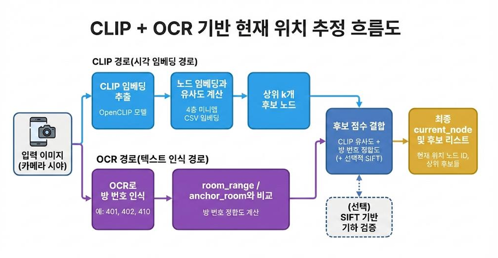

# CVM (Constraint-Aware Value Mapper)

[](https://www.python.org/)
[]()
[]()

> **The visual perception and decision-making engine that bridges camera inputs with navigation logic using Graph-based Visual Maps and Value Map v2 algorithms.**

## Overview

**CVM (Constraint-Aware Value Mapper)** is the perception module responsible for **Visual Localization** and **Next-Step Decision Making** in our GPS-denied indoor navigation system.

While the [CSM](https://github.com/caainp/caainp-csm) module manages the high-level plan, CVM processes real-time camera frames to determine the exact user location (`current_node`) and calculates the optimal movement direction (`value_map`) by fusing visual evidence, topological data, and dynamic constraints.

---

## System Architecture

<p align="center">
  
</p>

CVM operates as the bridge between the physical world (Camera) and the logical plan (CSM).

### Core Workflow

1.  **Visual Localization**: Identifies the `current_node` by analyzing the camera view using a multi-stage pipeline.
    - **OpenCLIP**: Semantic matching with reference node embeddings.
    - **OCR**: Text/Room number extraction for symbolic verification.
    - **SIFT**: Geometric feature matching for final validation.
2.  **Value Map Calculation (v2)**: Generates a score (0.0~1.0) for each navigable direction.
    - **Input**: CSM Route Plan (`route_nodes`) + Visual Candidates + History + Obstacles.
    - **Output**: The direction with the highest value is selected for AR guidance.

---

## Key Features & Logic

### 1. Graph-based Visual Map

We constructed a precise topological map of the AI Engineering Hall (4th floor).

- **Node Definition**: Corridors, Intersections, Elevators, Room Fronts.
- **Hybrid CSV Structure**:
  - `Logical`: ID, Type, Neighbors, Room Range, Anchor Room.
  - `Visual`: Pre-computed **CLIP Embeddings** of reference images for each node are embedded directly in the CSV.

### 2. Multi-stage Visual Localization

To estimate the `current_node` robustly without GPS, we use a hybrid approach:

- **Step 1: Semantic Matching (OpenCLIP)**
  - Converts the current camera frame into an embedding vector.
  - Calculates Cosine Similarity with the map's reference embeddings to find top candidates.
- **Step 2: Symbolic Verification (OCR)**
  - Extracts room numbers (e.g., "401") from the image.
  - Matches them against the node's `room_range` or `anchor_room` property to boost scores of matching nodes.
- **Step 3: Geometric Verification (SIFT)**
  - Performs feature matching on top candidates to resolve ambiguity between similar-looking corridors.

### 3. Value Map v2 (Extended Decision Algorithm)

Unlike the basic version that simply follows the path, **Value Map v2** makes context-aware decisions.

| Feature     | Value Map v1 (Basic)                                                          | Value Map v2 (Extended)                                                                                                |
| :---------- | :---------------------------------------------------------------------------- | :--------------------------------------------------------------------------------------------------------------------- |
| **Inputs**  | Current Node, Route Nodes, Visited Nodes                                      | All V1 inputs + **Visual Candidates**, **History**, **Obstacles**                                                      |
| **Logic**   | Rewards forward movement on the route; Penalizes backward/off-route movement. | Fuses route scores with **Visual Consistency** (Is the camera looking at the right path?) and **Dynamic Constraints**. |
| **Benefit** | Simple path following.                                                        | Stable navigation that handles visual uncertainty and prevents looping behaviors.                                      |

---

## Data Interface Specification

CVM exchanges standardized data with CSM and NAV modules.

### CvmResult (Localization Output)

```json
{
  "timestamp": 171542120,
  "current_node": 4102,
  "confidence": 0.85,
  "candidates": [
    { "node_id": 4102, "score": 0.85, "source": "CLIP+OCR" },
    { "node_id": 4101, "score": 0.45, "source": "CLIP" }
  ]
}
```

### Value Map Output

```json
{
  "current_node": 4102,
  "neighbors": {
    "4101": 0.9, 
    "4103": 0.2, 
    "4001": 0.0 
  }
}
```

## Project Structure

```bash
.
├── caainp_cvm/                  # Main System Package
│   ├── data/                    # Internal package data
│   ├── nav_engine.py            # Core Navigation Logic Engine
│   ├── paths.py                 # File path management utilities
│   └── __init__.py
├── node_images/                 # Reference Image Repository
│   └── node_images/             # Directory containing actual node reference images
├── scripts/                     # Executable Scripts & Core Modules
│   ├── debug_value_map.py       # Debugging tool for Value Map logic
│   ├── extract_gemini_pdf.py    # Utility for PDF data extraction
│   ├── localize_image.py        # Standalone Visual Localization script
│   ├── map_loader.py            # CSV Map parsing & Graph loading
│   ├── run_cvm_step.py          # Main CVM Pipeline execution script
│   ├── value_map.py             # Value Map v2 Calculation Logic
│   ├── __init__.py
│   └── __main__.py
├── ai_4f_node_map_fixed_embeded.csv  # Graph Map Data with CLIP Embeddings
├── map.png                      # Visual representation of the node map
├── nav_demo.py                  # Navigation demo entry point
├── pyproject.toml               # Project configuration & dependencies (uv)
├── uv.lock                      # Dependency lock file
├── requirements.txt             # Pip requirements file
├── CA-Nav-README.md             # Additional documentation
└── README.md                    # Project Documentationd
```

## Getting Started

### Prerequisites

- Python 3.8+
- PyTorch (CUDA support recommended)
- OpenCLIP, EasyOCR, OpenCV

### Installation

```bash
git clone [https://github.com/caainp/caainp-cvm.git](https://github.com/caainp/caainp-cvm.git)
cd caainp-cvm
pip install -r requirements.txt
```

## Usage Examples

You can run the modules via command line to test localization accuracy or the full CVM pipeline.

### 1. Test Visual Localization (Standalone)

Run `scripts.localize_image` to estimate the node ID for a specific image file using OpenCLIP and geometric priors.

```bash
python -m scripts.localize_image \
  --image "node_images/node_images/401(1).jpg" \
  --csv "ai_4f_node_map_fixed_embeded.csv" \
  --model "ViT-L-14" --pretrained "laion2b_s32b_b82k" \
  --device cpu --topk 5 \
  --use_geo --node_images_dir "node_images/node_images" \
  --prev_node 427 --w_geo 0.7 --w_prior 0.3
```

- **Arguments**:
  - `--image`: Target image path.
  - `--csv`: Map data file containing embeddings.
  - `--prev_node`: Previously estimated node (for geometric prior).
  - `--w_geo` / `--w_prior`: Weights for geometric verification and prior probability.

#### 2. Run Full CVM Step (Localization + Value Map)

Execute the main pipeline to estimate the current location and calculate the Value Map based on the latest input. Run this command from the repository root (`caainp-cvm`).

```bash
python -m scripts.run_cvm_step
```

Output: Displays the estimated `current_node` and the calculated `value_map` scores for navigation.

## Related Projects

- **CSM (Constraint-Aware Sub-instruction Manager)**: [Link to Repository](https://github.com/caainp/caainp-csm)  
  The logic brain that provides the route plan (`route_nodes`) to this module.
